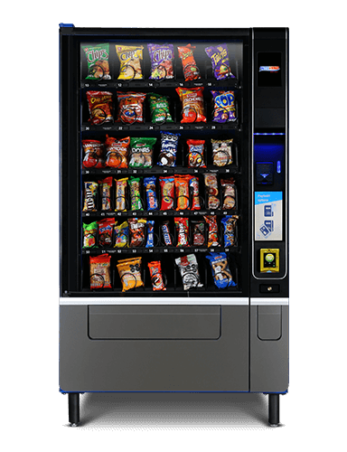

<a name="top"></a>
# Vending Machine
<p align="center">
   
</p>


<p align="center">This is a simulation of the behavior for the hardware of a vending machine in VHDL.

## Project Overview
The Basys 3 is an FPGA (Field Programmable Gate Array) board and stands as one of the most recommended and utilized tools for student training in system development through hardware description. In this project, the internal simulation of a candy vending machine will be carried out, aiming to receive money, dispense the product, and, if necessary, provide change. Prior to this stage, a thorough analysis of the development of a sequential design in VHDL will be conducted, specifically tailored for the Basys 3 board. This analysis will be performed using the EDA Playground development environment in collaboration with the Vivado 2018.2 plugin developed by Xilinx, Inc. To implement the design code for the Basys 3 board, we will use the Vivado 2018.2 software.
  
  
  
## Content List
- [Vending Machine](#vending-machine)  
- [Project Overview](#project-overview)  
- [Requirements](#requirements)
- [VHDL Code Development](#vhdl-code-development)
  - [Main](#main-code)
  - [Frequency Divider](#frequency-divider-(div_freq_1_hz).)
  - [Frequency Divider](#frequency-divider-(div_freq_1_hz).)
  - [Frequency Divider](#frequency-divider-(div_freq_1_hz).)
  - [Frequency Divider](#frequency-divider-(div_freq_1_hz).)
  - [Frequency Divider](#frequency-divider-(div_freq_1_hz).)
  - [Frequency Divider](#frequency-divider-(div_freq_1_hz).)
  - [Validation of the EDA Playground Testbench](#validation-of-the-eda-playground-testbench)
- [Initial Setup](#initial-setup)
  - [Installation](#installation)
  - [QSPI](#qspi)
  - [Hardware Configuration](#hardware-configuration)
  - [Basys 3](#basys-3)
  - [Simulation](#simulation)
  - [Changes in the original project](#changes-in-the-original-project)
- [Future Enhancements](#future-enhancements)
- [Important Links](#important-links)
- [Contact](#contact)
## Requirements

To run this project you need the following components:

- Vivado (Software).
- EDA Playground (Software).
- Basys 3.

# VHDL Code Development

In this section, the codes that compose this project will be described.

## Main Code (main)

General structure:
 
Inputs (in):
 
-	clk100Mhz: Main system clock.
 
-	Inputs for the switches, which select the coins of the different possible values: $1, $2, $5, $10. Represented by the switches (UP, DOP, CP, DP). To select the product, 5 switches were used to choose the product to be dispensed. Within the code, it was declared as a vector, with the name (PRODUCT_IN).
 
-	Another of the switches used was to select the product (CONF_COMPRA).
 
-	In order to reset the system, a push button declared within the code as (RST) was used.
 
Outputs (out):
 
-	LEDS: When the purchase is made (the money deposited is equal to or greater than the value of the product), they will be activated in a cascade to inform you that the product has been dispensed.
 
-	seg_display: Output that represents the segments of a seven-segment display.
 
-	select_display: Output indicating which digit should be shown on the seven-segment display.
 
Modules and Submodules:
 
-	Frequency Dividers (div_freq):
Generates several clocks divided from the main frequency (clk100Mhz).
They are used to create several clocks of different frequencies for different modules.
 
 
 
- Debouncer (debouncer):
 Used to debounce button signals (UP, DOP, CP, DP, RST, BUY_CONF).
Provides debounced (UP_IN_SIN_REB, DOP_IN_SIN_REB, etc.) and pulsed signals.
 
 
- Money Adder (money_sum):
 Add up the money received based on the buttons pressed and monitor the status of the system.
Generates signals such as sign_DineroRecibido and sign_RecibeMinero.
 
 - Number Divisor for Display (divNum_Uni_Dec):
 Divides the number of money, change and price into digits for display on seven-segment displays.
 
 - Product Selector (select_product):
 Controls product selection and obtains the price of the selected product.
 
 - Dispenser States (dispenser_states):
 Control the status of the dispenser based on product selection, confirmation and money received.
 Generates control signals such as signal_Dispense_out and signal_Give_change_out.
 
 - GetChange (get_change):
 Calculates the change that must be delivered to the user.
 
 - Show Dispense LEDs (show_dispense_leds):
 Controls the LED display based on the dispensing status and purchase confirmation.

- Display demultiplexer (demux_display):
 Controls the display on the seven-segment display depending on the system status.
 
Workflow:
 
-	The code uses multiple split clocks to synchronize different parts of the system.
 
-	The debouncer is used to clean up button signals.
 
-	The money adder manages the money received and controls the delivery of products and exchange.
 
-	The product selector gets the price of the selected product.
 
-	The status of the dispenser and the change module control the workflow for dispensing products and change.
 
-	The display modules control the presentation on LEDs and seven-segment displays.


## Frequency Divider (div_freq_1_hz).

The code is divided into two processes, gen_clock and persecond. The gen_clock process is responsible for counting and updating the clock state. When the counter reaches its maximum value (max_count), the clock is inverted (from 0 to 1 or vice versa). The counter is then reset to 0.

The persecond process simply takes the split clock value (clk_state) and assigns it to the clkSplit output signal.

This design has the advantage that the frequency of clkDivided can be easily changed by simply changing the value of max_count. Additionally, using an event-based account ensures that the split clock has a consistent, well-defined period, which is useful for controlling devices.

The code also includes a reset to reset the counter and split clock signal at any time.

  
  <p align="center">
  
  </p>
  
## Counter from 0 to N bits (counterNbits).

The code is an N-bit counter in VHDL.

The counter starts at 0 and increments by 1 each time the 100 MHz clock (clk_100MHz_counter) goes high (positive clock event).

When "count_enable" is activated, the counter increments its value.

When the counter reaches the maximum value allowed by N bits (2^N - 1), an output signal "terminal_count" is generated.

The output "counter_out" is an N-bit vector representing the current value of the counter.
The output "counter_out_int" is an integer representing the current value of the counter.


The code defines a counter that counts up to the maximum value allowed by N bits and resets itself when this value is reached. It can also be enabled and disabled using the "count_enable" signal. The output of the counter is an N-bit vector and an integer. 

The "terminal_count" signal is activated when the counter reaches its maximum value.

## Demultiplexer to show numbers on display (demux_display).

The circuit shown is a multiplexer (mux) that is responsible for controlling which display should turn on. This is achieved using a clock signal (clk1000hz) and a state signal (refresh_state).

The mux has 4 outputs, which represent the 4 displays in the circuit. To determine which display should be turned on, a process based on a counter is used that runs through all possible state values.

The "show_display" process uses a sequence of 16 possible values for the state, which are divided into 4 substates of 4 values each. Each substate represents a different state that the mux must be in to control which display should turn on.

The mux also uses a register called "display_sel" to store the current display selection. The "curr_display" signal is used to send this information to the outside of the mux.

Additionally, the "show_display" process uses a set of case instructions to determine which values should be shown on the displays based on the current display selection and other input signals (Confirm_purchase_IN).

Finally, it is worth mentioning that the circuit design is based on a multiplexer with a minimum of components, which facilitates its implementation and reduces costs. However, the use of a register and a counter also involves some consumption of additional resources in terms of time and area.

## Adder (money_sum).
The sum of money is a module that counts the coins received at a dispenser. To implement this module, we must first create a record that stores the amount of money received so far.

The "prev_currency" register is updated every time a currency is detected. The variables UP_IN, DOP_IN, CP_IN and DP_IN are used to detect the receipt of coins. When a coin is detected, the "prev_currency" register is incremented by 1, 2, 5, or 10, depending on the coin that was received.

The "DineroReci" signal is used to inform the rest of the system of the amount of money received. This signal is an-output of the module.

 The "ReceiveMoney" signal is an-output that indicates whether money has been received or not. It is set to '1' when a coin is detected and reset to '0' when no coin is detected.
 
Additionally, an additional signal "RST_IN" is used to reset the money counter. When "RST_IN" is '1', the money counter is reset to 0.

Finally, a process is implemented that manages the flow of information. This process checks if a coin has been detected or the command to reset the money counter has been received. If a currency has been detected, the "prev_currency" register is incremented based on the currency that was received. If the command to reset the money counter has been received, the register "prev_currency" is reset to 0.

In summary, the sum_money module counts the coins received at a dispenser. To do this, it uses a register to store the amount of money received and performs increment and reset operations based on input signals indicating the receipt of coins and the command to reset the money counter.
The buttons on the machines register the following data:

- UP_IN – One peso
- DOP_IN – Two pesos
- CP_IN – Five pesos
- DP_IN – Ten pesos

## Product Selector (select_product)
The code of the "select_product" entity is responsible for reading and saving the product that the user wishes to choose. The entity takes 6 input signals (PRODUCT_1 to PRODUCT_5 and CONFIRM_BUY) and generates 2 output signals (product_selected and product_price).
 
When a product is selected, the "product_selected" signal is activated and the price of the selected product is stored in the "product_price" signal.
 
When the CONFIRM_BUY signal is activated, the product is deselected and the values of the "product_selected" and "product_price" signals are reset.

## Decimal to display 7 segments of the tens (bcd7seg_dec) 

The code is a VHDL module that implements a converter from BCD to 7 tens segments. The Behavioral architecture of the module contains a process that performs the conversion according to the BCD-7Seg encoding pattern.
 
The bcd7seg_dec entity has a single input port dec, which receives an integer between 0 and 9. This number represents the ten to be converted.
 
The output port dec_segments is a 7-bit vector output, which represents the 7-segment representation of the tens of the entered number.
 
The module's internal process uses a local variable segments of type std_logic_vector (6 downto 0) to store the conversion result. The conversion is performed using a case statement that evaluates the entered value and assigns the corresponding value to the segments variable.
 
Finally, the process maps each bit of the segments vector to the output port segments_dec, thus completing the implementation of the module.

## Decimal to display 7 segments of units (bcd7seg_uni)

The code provided defines a component "bcd7seg_uni" that takes an integer from 0 to 9 as input and returns a 7-bit vector representing the activation of each segment on the 7-segment display.
 
The component logic is implemented within a process block that is executed every time the value of the integer changes. Within the process block, a "segments" variable declaration is used to store the bit pattern that represents the activation of each segment on the 7-segment display.
 
A "case" statement is then used to determine the bit pattern that corresponds to the input integer. Each branch of the case assigns a bit pattern to the segments variable.
 
Finally, the bits of the "segments" variable are connected to the output terminals of the component. This allows the bit pattern representing the activation of each segment on the 7-segment display to be transmitted outside the component.

## Divide number into tens and units (divNum_Uni_Dec)

The code you provided divides a number into two digits, ones and tens. These digits are converted to BCD numbers and displayed on the corresponding 7-segment displays.
 
The process of dividing the number into ones and tens is done within a process block, which is executed every time the value of the number changes. The process block checks to see if the number is 0, in which case the ones and tens are set to 0. If the number is not 0, the ones and tens are obtained using the modulo operation and division.
 
For each BCD digit (ones and tens), a "bcd7seg_uni" and "bcd7seg_dec" component is used respectively, which convert the BCD digit into a 7-bit vector that represents the activation of each segment on the 7-segment display.

## Debouncer (debouncer)

This code defines a debouncer module that uses a shift register and a counter to slow down the button read. The debounce logic is based on detecting when the shift register contains only '1'.
 
A "counterNbits" component is used to count the number of clock cycles since the button was last read. This component is initialized with a 20-bit counter.
 
On each clock cycle, the shift register is updated to store the current state of the button and the previous 7 states.
 
If the shift register contains only '1', then the button is considered stable and the module sends a pulse to the "btn_out_reg" output.
 
The "debouncer" module has two flip-flops (ffl and ff2) to store the current state and the previous state of "btn_out_reg". This is used to detect transitions in the button state.
 
The "btn_pulsed" output is activated when there is a transition in the button state (from 0 to 1). This is achieved by applying the "and" operation between the current and previous states of "btn_out_reg" (ffl and ff2, respectively).
 
The "debouncer" module is designed to work with clocks up to 100 MHz and is capable of handling high-speed transitions on the button.

## Dispenser States (dispenser_states)

This code represents an FSM (Finite State Machine) that controls the states of a dispenser.
 
The code is organized into different logical blocks: STATE_MEMORY, NEXT_STATE_LOGIC and OUTPUT_LOGIC.
 
In STATE_MEMORY, the current state is memorized. The process is synchronized with the clock, so it is updated on each edge rise.
 
In NEXT_STATE_LOGIC, state transition logic is performed. The current state and the selected product signal are evaluated to determine the next state.
 
In OUTPUT_LOGIC, the output logic is realized. The current state is evaluated and the Dispense and Give_Change control signals are activated accordingly.
 
The states and their transitions are defined in the table of the following logical block. For example, if the FSM is in state "state_Wait" and a product is selected (productSelected = '1'), the next state will be "state_P_Select".
 
This code implements a simple FSM that can be extended and adapted to different applications. However, it should be noted that the code only shows a theoretical and conceptual approach to the circuit design, and does not provide information on how to physically implement the circuit on an FPGA or other type of hardware device.

## Change Delivery (get_change) 

The provided code implements a circuit that determines the value of change that should be returned to the user after purchasing a product. This circuit is based on a process that is executed on each edge rise of the clock.
 
When the confirmation signal (Confirm) is activated ('1'), the circuit calculates the value of the change as the difference between the accumulated money (accumulatedmoney) and the price of the product (Productprice). This value is then stored in the "change_value" signal.

## Confirm purchase with LEDS (show_dispensar_leds)

This code is responsible for displaying a bit pattern on LEDs after confirming a purchase.
 
Count starts when startCount is high and Confirm_Purchase_IN is also high.
 
When the purchase is confirmed (Confirm_purchase_IN is high), it counts to 18, then activates signal_endCount and increases countNumber by 1.
 
The LEDs show an ascending bit pattern, achieving a cascade effect, where the LEDs turn off from the largest LED (15) to the smallest (0).
 
When signal_endCount is high, LEDS is set to zero. 

  
### Obtaining and validation of the Forward Kinematics and Inverse Kinematics using Matlab.

Made the DH parameters, it is possible to obtain the direct and inverse kinematics of the robot, this will be done using the Matlab software, in conjunction with Peter Corke's "Robotics Toolbox" plugin, by obtaining and validating both kinematics we can obtain the kinematic analysis of the robot.

In general, the procedure consists of generating the robot in Matlab, giving the specifications of the measurements and types of the joints, as well as the rotation that they have, that is, substituting the values in the DH matrix, which remains in the following way:

<p align="center">
  
</p>

Using the ".teach" command, the graphical interface of the robot is printed, which is as follows:


<p align="center">
  
</p>


The direct kinematics is obtained by calculating through the analysis of each of the joints, to later obtain the analysis of the entire robot by multiplying the results of all the joints, the procedure for each joint is as follows:

<p align="center">
  
</p>

Therefore, it is enough to substitute the values ​​in each of the operations, said values ​​are the same as those of the DH table, this applies to all the joints of our robot, with which it only remains to multiply the analyzes of the different joints. To know that the calculation is correct, the values of the matrix obtained are compared with the values ​​of the simulation, as observed below:

<p align="center">
  
</p>


Since the values are the same, the calculation is correct.

To obtain the inverse kinematics, a complex analysis must be carried out for each joint, in which the procedure differs depending on the characteristics of each one, so using the Robotics Toolbox plugin, the ".ikine" command can be used, which performs the calculation in the position that we assign, the result is shown below:

<p align="center">
  
</p>


With both kinematics validated, we proceed to use Ros and Gazebo.


[Back to Top](#top)
## Initial Setup

### Installation
Is important to say that is recomended to install Ubuntu 20.04 in the computer not in a Virtual Box.
The OpenManipulator is configurated to work in ROS Noetic in the mentioned Ubuntu version, once the Ubuntu is installed is recomended to install ROS from the Wiki:
http://wiki.ros.org/noetic/Installation/Ubuntu


However the installation also can be donde with this comand that is the fast installation:
```ROS
$ sudo apt update
$ wget https://raw.githubusercontent.com/ROBOTIS-GIT/robotis_tools/master/install_ros_noetic.sh
$ chmod 755 ./install_ros_noetic.sh
$ bash ./install_ros_noetic.sh
```

Install dependent pacakges
```ROS
$ source ~/.bashrc
$ sudo apt-get install ros-noetic-ros-controllers ros-noetic-gazebo* ros-noetic-moveit* ros-noetic-industrial-core
$ sudo apt install ros-noetic-dynamixel-sdk ros-noetic-dynamixel-workbench*
$ sudo apt install ros-noetic-robotis-manipulator
```
Download and build OpenMANIPULATOR-X packages
```ROS
$ cd ~/catkin_ws/src/
$ git clone -b noetic-devel https://github.com/ROBOTIS-GIT/open_manipulator.git
$ git clone -b noetic-devel https://github.com/ROBOTIS-GIT/open_manipulator_msgs.git
$ git clone -b noetic-devel https://github.com/ROBOTIS-GIT/open_manipulator_simulations.git
$ git clone https://github.com/ROBOTIS-GIT/open_manipulator_dependencies.git
$ cd ~/catkin_ws && catkin_make
```
This project is an addition for the OpenManipulator_teleop. A CPP program was created in the 'src' directory, and all the dependencies such as the launch files and headers were created. Additionally, the CMake file was modified to add the pick and place function. To use this project, ensure that all the OpenMANIPULATOR-X packages are installed. Then, create a new code file with the desired name and location, either through VS Code or directly in a text editor. Remember to save the file with the corresponding name. You can check deeper this part in Changes in the original project
### Open CR
Once all the OpenMANIPULATOR-X packages are installed and ROS (Robot Operating System), the hardware provided by the lab for the manipulation of the robot is the OpenCR
<p align="center">
   
</p>
In order to connect the computer to the Open Manipulator X, it is important to download Arduino. As of the date of this project, the downloaded version is Arduino IDE 1.8.19, specifically for Linux.


https://www.arduino.cc/en/software


Once Arduino is downloaded, is time to configured the Open CR to the port of the computer, the Open has a guide where in case of the Open CR is not flashed the new user can configured as well in the following link:

https://emanual.robotis.com/docs/en/parts/controller/opencr10/#arduino-ide

First the ports are configured:

USB Port Settings
```ROS
$ wget https://raw.githubusercontent.com/ROBOTIS-GIT/OpenCR/master/99-opencr-cdc.rules
$ sudo cp ./99-opencr-cdc.rules /etc/udev/rules.d/
$ sudo udevadm control --reload-rules
$ sudo udevadm trigger
```
Compiler Settings
```ROS
$ sudo apt-get install libncurses5-dev:i386
```
Now once Arduino is downloaded extract the file and install it.

```ROS
$ cd ~/downloads/arduino-1.8.19
$ ./install.sh
```
Set the file path of installed Arduino IDE as an absolute path named PATH in the bashrc file.
```ROS
$ gedit ~/.bashrc
$ export PATH=$PATH:$HOME/tools/arduino-1.8.19
$ source ~/.bashrc
```
Porting to Arduino IDE(Linux)
Install the OpenCR package via Boards Manager
Click Tools → Board → Boards Manager.
<p align="center">
   
</p>
<p align="center">
   
</p>
However, if is not clear enough there is the link for the Open CR in the links given above

[Back to Top](#top)
### Simulation
Once all the previous steps are done the implementation can be done.

For initialized the Open is command is necessary to give torque to the motors by the following comand:
```ROS
$ roslaunch open_manipulator_controller open_manipulator_controller.launch usb_port:=/dev/ttyACM0 baud_rate:=1000000
```
To run the project you need to write the following command
```ROS
$ roslaunch open_manipulator_teleop open_manipulator_teleop_Pick_and_Place.launch
```
<p align="center">
   
</p>
Once the user select a option, the interface will be showing each step that the robot needs to complete the task selected.

Finally, depending of the choice the robot wil start moving, in the video is shown the Palletizing and the Depalletizing:


<p align="center">
  <a href="https://www.youtube.com/watch?v=AY5m8ooS1Zg"></a>
</p>

## Changes in the original project
All the codes were created in c++ taking as a base the Original file of OpenManipulator_Teleop, if you want to use this example of pick and place you can add all the files to the original documents in the part of OpenManipulator_Teleop, as the Header, the Lunch and the C++ in the src file where is located the program, also is important to modify the CMakeLists.txt, the exact part that needs to be added is the following part:

```ROS
add_executable(open_manipulator_teleop_Pick_and_Place src/open_manipulator_teleop_Pick_and_Place.cpp)
add_dependencies(open_manipulator_teleop_Pick_and_Place ${${PROJECT_NAME}_EXPORTED_TARGETS} ${catkin_EXPORTED_TARGETS})
target_link_libraries(open_manipulator_teleop_Pick_and_Place ${catkin_LIBRARIES})
```
Where this code is responsible for compiling and building an executable named "open_manipulator_teleop_Pick_and_Place", specifying its dependencies, and linking necessary libraries to it in a ROS project.

You can add this files in VS code or in a text note just save the files with the same name and termination, and for the Cmake just modify it.


## Add New Things

If you want to contribute to this project, please follow these steps:

1. Set the positions of the things that where the Open will do the pick and place.
2. With the matlab codes calculate the inverse kinematics to obtain the positions of the ariticulations.
3. That values can be simulated with the GUI Program. (Do not forget to connect to the Open before, just instead of lunch the new program lunch the following one)
```ROS
roslaunch open_manipulator_control_gui open_manipulator_control_gui.launch
```
<p align="center">
   
</p>

4. Verify the positions and save it in the new cpp code .
5. Is recomended to simulate first in Gazebo to avoid problems with the real Open.

Launch Gazebo:
```ROS
$ roslaunch open_manipulator_gazebo open_manipulator_gazebo.launch
```
Connect the Open to Gazebo
```ROS
$ roslaunch open_manipulator_controller open_manipulator_controller.launch use_platform:=false
```
Launch your program
```ROS
$ roslaunch open_manipulator_teleop open_manipulator_teleop_Pick_and_Place.launch
```
<p align="center">
   
</p>


if the simulation is correct now you can do it with the OpenManipulatorX

## Important Links
For the VHDL compiler you can use this link to check it:

–link eda

For the QSPI you can check this link:

https://youtu.be/5pV0R82A_CE?si=vsrD9TKzp-9_Ht8v

For the Basys 3:

https://digilent.com/reference/programmable-logic/basys-3/reference-manual

Also, other source where more information can be found is the the following book:

https://issuu.com/umbrella12/docs/2019_book_quickstartguidetovhdl


[Back to Top](#top)

## Contact 
Authors:

Ricado Ramos Morales - ricardo.ramosms@udlap.mx - Github: 

Adriel Ivann Ferrer Alejo - adriel.ferrerao@udlap.mx - Github: IvannFerrer 

Irving Alejandro Vásquez Salinas - irving.vasquezss@udlap.mx - IrvingVasquez3

Project Link: 

# Enjoy, entertain yourself, and improve the program!
